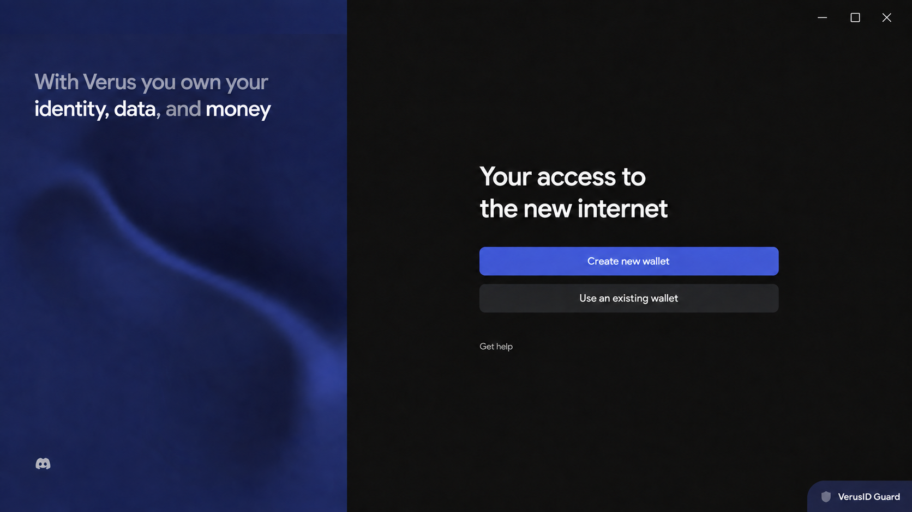
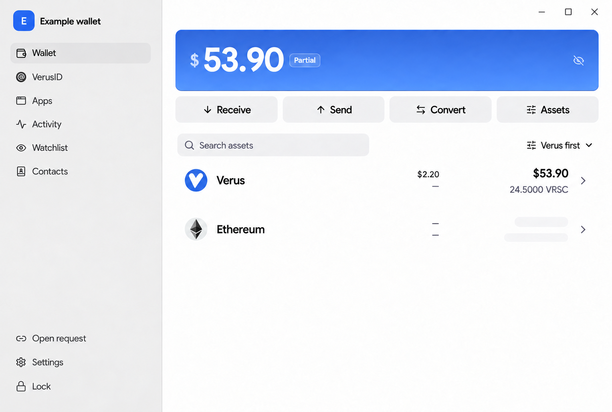

# Desktop window chrome on Windows and Linux

This note records the intended window treatment for a later platform pass. The
Windows mockups below are visual concepts, not screenshots of a Windows build.
The wallet data in them is synthetic. Dimensions, system behavior, and theme
details need validation in the native app before implementation is accepted.

## Current source state

- [`tauri.conf.json`](../../src-tauri/tauri.conf.json) uses a decorated window
  with `titleBarStyle: "Overlay"`, `hiddenTitle: true`, and a custom
  `trafficLightPosition`. The last three settings target macOS; the configured
  native frame remains the starting point on Windows and Linux.
- [`AppSidebar.svelte`](../../src/lib/components/wallet/AppSidebar.svelte) gives
  the wallet header `pt-11` to clear the macOS traffic lights.
- [`WalletLayout.svelte`](../../src/lib/components/wallet/WalletLayout.svelte)
  overlays a 44 px drag region on the left and reserves a smaller drag region
  above the main pane. Welcome, unlock, and several other flows also define top
  drag regions. These regions need a platform-wide audit before moving content
  upward so they do not cover interactive controls.

## Selected Windows direction

- Use a custom, visually integrated top region. It follows each screen's own
  surface rather than appearing as a separate title bar.
- Show **no app title and no app icon inside the window**. Keep the window title
  `Verus Express` in OS metadata and keep the packaged app icon for places such
  as the taskbar and app switcher.
- Place understated minimize, maximize/restore, and close glyphs at the top
  right. The concept uses a roughly 32–36 px tall top region and smaller glyphs,
  centered in comfortable click areas. The glyphs may be small; their effective
  click areas, keyboard access, focus states, and hover feedback must remain
  usable. The mockups do not show those invisible areas or states.
- Let the welcome screen's navy and dark surfaces continue to the top edge. In
  the wallet, move the identity row and primary navigation upward into the space
  previously reserved for macOS controls. Keep the footer actions anchored at
  the bottom.
- Apply the same window treatment to unlock, onboarding, wallet, dialogs, and
  other top-level views so transitions do not change the frame unexpectedly.

### Visual references

These ImageGen edits are direction references, not pixel specifications. They
were based on current app captures and may differ in fine typography or spacing.

## Linux / Ubuntu direction

- Retain the native decorated title bar. Ubuntu commonly places its controls on
  the right, but Linux window managers and user settings can change their
  appearance and position; do not draw fixed assumptions into the web UI.
- Remove the macOS-only empty space above the sidebar header and audit the
  redundant webview drag strips. Let the wallet identity and navigation start
  near the top of the app content, below the native frame.
- Keep the first pass limited to spacing and overlap corrections. Check both
  light and dark themes with the actual desktop environment used for testing.

## Windows implementation questions and acceptance

A fully custom window frame can produce the selected look, but it takes over
window behavior that a native frame normally supplies. Before choosing the
implementation route, verify what Tauri and the Windows APIs can preserve with
system-drawn caption controls. If the smaller visual treatment requires custom
buttons, implement and test the missing behaviors explicitly.

- Drag from empty top areas; do not drag from buttons, links, fields, or the
  wallet identity control. Support double-click maximize/restore and the window
  system menu where Windows users expect them.
- Preserve resizing from every edge and corner, maximize/restore, minimize,
  close, keyboard operation, focus feedback, and high-DPI behavior.
- Test Windows Snap Layouts, especially hover on maximize. Custom maximize
  buttons may need Windows non-client hit testing to expose the native Snap UI.
- Keep controls visible and usable in light and dark mode, active and inactive
  windows, maximized and restored states, and at the 920 × 620 minimum size.
- Check onboarding, unlock, wallet, and dialogs for overlap after removing
  macOS-specific drag overlays and top padding. Run a native Windows pass;
  browser renders and these mockups cannot prove window-manager behavior.

The smaller glyphs mainly reduce visual weight. Meaningful space savings come
from a shorter top region or narrower button zones; making the click zones too
small would reduce precision and accessibility. Do not treat the mockup's
apparent spacing as a reason to shrink the interactive targets further.

## Platform references

- [Tauri window configuration](https://v2.tauri.app/reference/config/)
- [Tauri custom title bars](https://v2.tauri.app/learn/window-customization/)
- [Windows title bar design](https://learn.microsoft.com/en-us/windows/apps/design/basics/titlebar-design)
- [Windows Snap Layout integration for custom caption buttons](https://learn.microsoft.com/en-us/windows/apps/desktop/modernize/ui/apply-snap-layout-menu)
